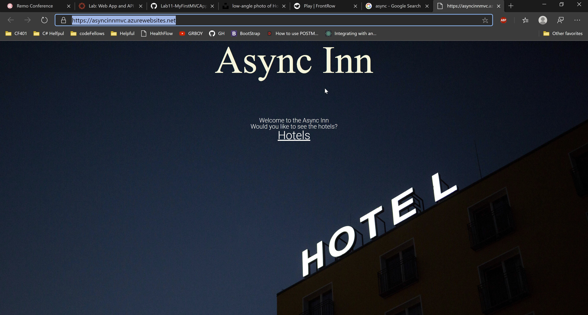
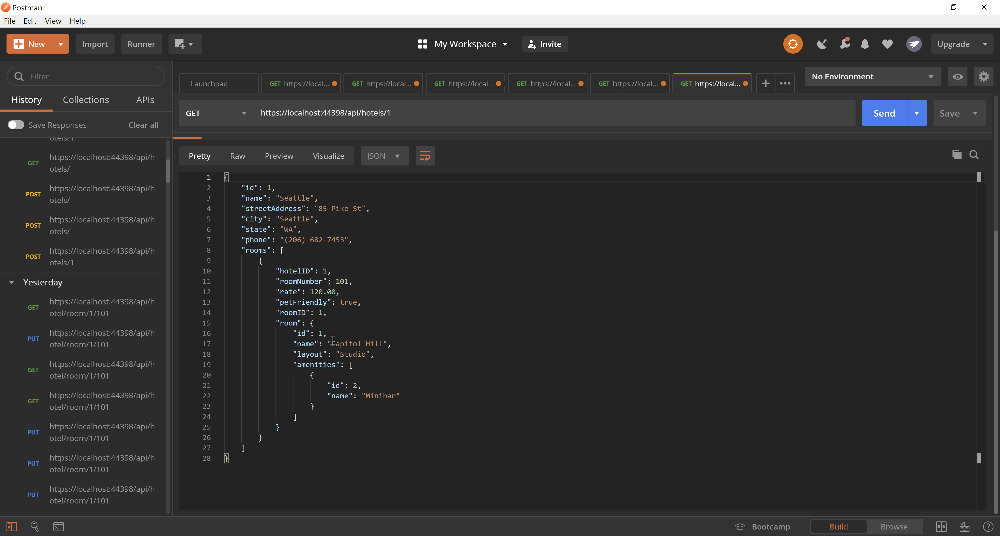

# Async-Inn

----

***Authors:***   
[Matthew Johnson](https://github.com/SEAsouthern)  
[Jin Kim](https://github.com/jinwoov)

----

### We are deployed on Azure!

Front end website:   
https://asyncinnmvc.azurewebsites.net/

API server:   
https://asyncinnapi.azurewebsites.net/api/

----

## Description

This lab demonstrate your uses of hotel scenario to practice setting up for ERD. In this scenario there are six relational tables that comprise our database. 

---

## Getting Started

Clone this repository to your local machine.

```
$ git clone https://github.com/jinwoov/Async-Inn.git
```
Once downloaded, you can either use the dotnet CLI utilities or Visual Studio 2019 to build the web application. The solution file is located in the AsyncInn subdirectory at the root of the repository.
```
cd AsyncInn/AsyncInn
dotnet build
```
The dotnet tools will automatically restore any NuGet dependencies. Before running the application, the provided code-first migration will need to be applied to the SQL server of your choice configured in the solution secret file. This requires the Microsoft.EntityFrameworkCore.Tools NuGet package and can be run from the NuGet Package Manager Console:
```
Update-Database
```
Once the database has been created, the application can be run. Options for running and debugging the application using IIS Express or Kestrel are provided within Visual Studio. From the command line, the following will start an instance of the Kestrel server to host the application:
```
cd AsyncInn/AsyncInn
dotnet run
```

---


### Visuals

### Screenshots


Front page


Hotel Lists


Final Page



Final result of our postman search


#### ERD Diagram


---

#### Explanation of diagram

1. Async Inn(Hotel)
- The hotel is named `Async Inn` and has many nationwide locations. Each location will have a name, city, state, address, and phone number. It navigates to the hotel room and price join table with payload. Hotel will have one to many relation with both.

2. Hotel Room(Join Table)
- The hotel room join table pulls in combination key from Async Inn and room and has many to one relationsihp with both.

3. Room
- Each room will have a room ids, nick names, amenitites and price per locations. It navigates to the amenities and hotel room tables and has a one to many relationship with both. It has many to one relationship with the enum room type.

4. Price (Join table with payload)
- The rooms vary in price, per location, as well as per room number. It navigates to Async Inn(hotel) and room. Price will have one to many relation with both.

5. Amenities
- Amenities consist of features like “air conditioning”, “coffee maker”, “ocean view”, “mini bar”. It navigates to the room table has a one to many relationship.

6. Room Types (enum)
- Some have one bedroom, others have 2 bedrooms, while a few are more of a cozy studio. It navigates to the room table has a one to many relationship.

### Change Log
- 7.2: *Screenshots are uploaded and documentation is completed* April 12 2020
- 7.1: *Finished linking front and API server* April 12 2020
- 7.0: *Created front web application* April 11 2020
- 6.2: *Summary comments are added* April 10 2020
- 6.1: *Completed application and updated final README documentation* April 10 2020
- 6.0: *Seed the new information and implementation of hotelDTO is finished* April 9 2020
- 5.3: *The update method for hotel room is updated* April 8, 2020
- 5.2: *Created a DTO for HotelRoom and connected all of the data together.* April 8, 2020
- 5.3: *Created a DTO for Amenities and room is connected* April 8, 2020
- 5.0: *Added Amenities DTO and refactored Get andd Push code to accept.* April 8, 2020
- 4.2: *Connected Amenities to Room and Hotel to Rooms to Amenities. Added the NewtonsoftJSON loop handling.* April 8, 2020
- 4.1: *Created interfaces and services for dependency injection and applied it to our controller* April 7, 2020
- 4.0: *Added dependency injection in to our project using interface and services* April 7, 2020
- 3.3: *Controllers added for all models* April 6, 2020
- 3.2: *Room, Hotel and Amenities dbs seeded with hardcoded data.* April 6, 2020
- 3.1: *Secrets built out and added to Startup. Additional comments added to all the models.* April 6, 2020
- 3.0: *Switched to Matthew Driving* April 6 2020
- 2.1: *Migrated and updated database* April 2 2020
- 2.0: *Created a new classes in the models folder. In DbContext, created a new table for each entity class. We added composite keys association with own overriden `OnModelCreating` method* April 2 2020
- 1.4: *Added migration* - April 2 2020
- 1.3: *Scaffolding database, install all needed dependencies* - April 2 2020
- 1.2: *Lab 12 complete, updated our ERD diagram* - April 2 2020
- 1.1: *Added description of ERD diagram* - April 1 2020
- 1.0: *Created repo and added image to the README documentation* - April 1 2020  